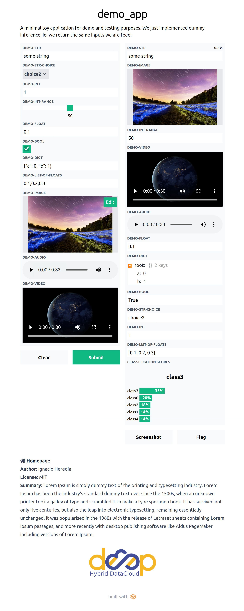

# DEEPaaS UI

> :warning: This is **work-in-progress**, might not work everywhere.
>
> **TODOs**:
> * implement single output returns
> * try to fix UI block when empty inputs
> * ¿make the parsing of the API parameters recursive? (now we parse dtypes for the first level of the json only)


This is a simple User Interface over models served through the [DEEPaaS API](https://github.com/indigo-dc/DEEPaaS). It only wraps the `PREDICT` method, for `TRAIN` you still have to go through the DEEPaaS API.

The motivation was to provide the end user with a friendlier interface than the Swagger UI.  It is built with the [Gradio](https://github.com/gradio-app/gradio) package, that enables to easily create interfaces to any ML model (or any function for that matter).

To use it, you need to point to a DEEPaaS API endpoint. If you don't have one, consider running the lightweiht [demo_app](https://github.com/deephdc/demo_app) to get the feeling of what the UI looks like. Once you have the app running (for example at http://0.0.0.0:5000/) you can deploy the UI:
```bash
git clone https://github.com/deephdc/deepaas_ui && cd deepaas_ui
pip install requirements.txt
python launch.py --api_url http://0.0.0.0:5000/ --ui_port 8000
```

## Advice for model developers

* If several models are found in the API endpoint, it will only deploy an interface for the first model found.
* If you model is multioutput, you should return a JSON with a correctly defined schema, where multimedia data has been encoded in `base64`.
* If you are performing a classification, please return in that JSON the keys `labels` and `predictions` (with the probabilitities) to get a [fancy classification display](https://gradio.app/docs#o_label). 
* If you have image/video/audio in your input args, you have to use the [webargs/marshmallow](https://marshmallow.readthedocs.io/en/latest/marshmallow.fields.html#marshmallow.fields.Field) `Field()` arg  and provide the `image`/`video`/`audio` keyword in the arg description.
* If you have image/video/audio in your output args, you have to use the [webargs/marshmallow](https://marshmallow.readthedocs.io/en/latest/marshmallow.fields.html#marshmallow.fields.Field) `Str()` arg  and provide the `image`/`video`/`audio` keyword in the arg description. The file should be returned as a `base64` encoded string.
* Videos only support `mp4` files.
* Audio only support `wav` files.
* Try to have default values for all provided inputs as the UI blocks when some input is not filled.

All these  best practices can be seen in the [demo_app](https://github.com/deephdc/demo_app/blob/master/demo_app/api.py) implementation. Here is how the UI looks like (left-hand side are inputs, right-hand side are outputs):

