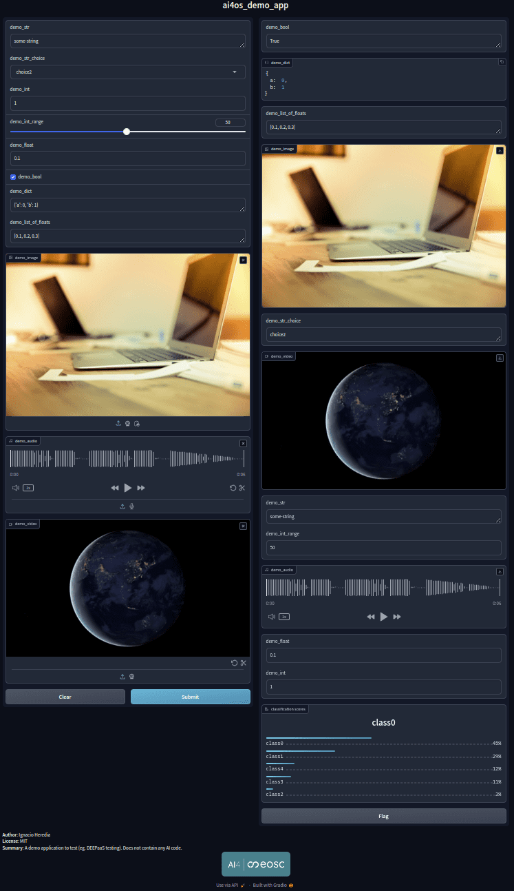

<div align="center">
  
</div>

# DEEPaaS UI

[](https://conventionalcommits.org)

This is a simple User Interface over models served through the [DEEPaaS API](https://github.com/indigo-dc/DEEPaaS). It only wraps the `PREDICT` method, for `TRAIN` you still have to go through the DEEPaaS API.

The motivation is to provide the end user with a friendlier interface than the Swagger UI.  This UI is built with the [Gradio](https://github.com/gradio-app/gradio) package, that enables to easily create interfaces to any ML model (or any function for that matter).

## Usage

To use it, first you need to run DEEPaaS with a module. If you don't have a module installed, consider running the lightweight [demo_app](https://github.com/ai4os-hub/ai4os-demo-app) to get the feeling of what the UI looks like.
```
pip install git+https://github.com/ai4os-hub/ai4os-demo-app.git
deepaas-run --listen-ip 0.0.0.0 --listen-port 5000
```

Once you have the app running, you can deploy the UI:
```bash
git clone https://github.com/ai4os/deepaas_ui && cd deepaas_ui
pip install -r requirements.txt
python launch.py --api_url http://0.0.0.0:5000/ --ui_port 8000
```

> ⚠️ **Additional requirements**:
>
>If your model needs to needs tpm process video as input/oputput, Gradio [needs](https://github.com/gradio-app/gradio/blob/9e0d6774b841ea0420ad5dbaeb516f1ad3b494c2/gradio/processing_utils.py#L907-L933) an [ffmpeg](https://ffmpeg.org/) installation:
>```console
>sudo apt install ffmpeg
>```


## Advice for model developers

* If several models are found in the API endpoint, it will only deploy an interface for the first model found (!).
* If you model returns a JSON, you should define a proper schema in order to get a fancy display in Gradio. Otherwise you will be shown the output as a plain dict in Gradio.
* If you want to return multimedia files in a JSON, they should be encoded as `base64`.
* If you are performing a classification, please return in that JSON the keys `labels` and `predictions` (with the probabilities) to get a [fancy classification display](https://www.gradio.app/docs/gradio/label).
* If you have image/video/audio in your input/output args, you have to use the [webargs/marshmallow](https://marshmallow.readthedocs.io/en/latest/marshmallow.fields.html#marshmallow.fields.Field) `Field()` arg  and provide the `image`/`video`/`audio` keyword in the arg description, in order for those to be nicely rendered by Gradio. Otherwise they will be rendered as plain files.


## Implementation notes

> **TODOs**:
> * ¿make the parsing of the API parameters recursive? (now we parse dtypes for the first level of the json only)
> * support [annotated image](https://www.gradio.app/docs/gradio/annotatedimage)?
> * change tab name to "AI4EOSC UI" but this implies [using Blocks](https://github.com/gradio-app/gradio/issues/385#issuecomment-1496307775) which make the code uglier

#### On the Gradio version and compatibility issues

Initially Gradio `2.3.9` was used. It worked fine in most cases.

But it could not work when a module offers more than one possible choice of `accept` MIME in the response. This happens because the Gradio interface is generated before the `accept` parameter is defined by the user (when calling `predict()`). The only possible solution was to fix the `accept` type, thus not letting the user to decide the response type.

However this could be fixed starting from version `3.0` through the use of Gradio `Tabs`. So we could basically create a different `Tab` for each MIME. But `3.0` only works for Python `3.7+` due to [this](https://stackoverflow.com/questions/52889746/cant-import-annotations-from-future).

Given that, at the time of this decision (July 2024), Python `3.7` has reached it's end of life support, we take the decision to move to Gradio `4.37.2` (compatible with Python `3.8.8`).
This implies that old modules will no longer be compatible with latest deepaas-ui. We leave nevertheless a backward compatible version just in case (branch `backward-compatible`), though it is _very_ outdated.

## Example: demo app

All the  best practices can be seen in the [demo_app API implementation](https://github.com/ai4os-hub/ai4os-demo-app/blob/main/ai4os_demo_app/api.py). Here is how the UI looks like (left-hand side are inputs, right-hand side are outputs):


